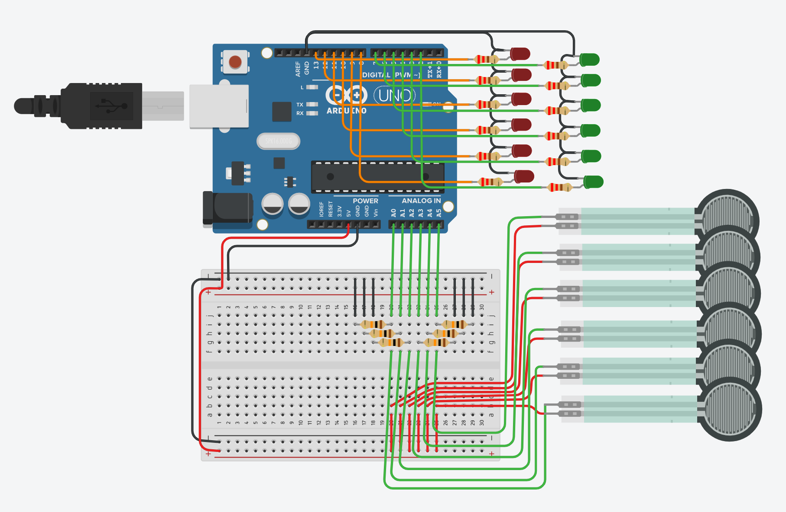

# Plantar Pressure Distribution
---

# Setup

## Materials
- ELEGOO ESP-WROOM-32 Board
- 6x (RP-C18.3-LT Rev B FSR)[https://robu.in/wp-content/uploads/2024/08/Data-Sheet-of-RP-C18.3-LT-Rev-B.pdf]
- 6x 10kOhm measuring resistors
- Lots of jumper wires and M-M header pins as necessary to wire the microcontroller to sensors
- Solder + soldering iron, to secure the force sensors to jumper wires

## Visual Circuit Diagram

Note that the TinkerCAD uses an Arduino Uno R3, which has a different pinout to the ESP32 in our materials list. The wiring is identical other than changing the pin connections. The LEDs were deemed to be unnecessary for gait correction purposes since they are redundant with the interface and were not implemented in the code or in hardware.

**Arduino IDE**:

1. Install the `esp32` Board Manager from the left sidebar tab.
2. For Windows: under Files > Preferences and for Mac: under Arduino IDE > Settings, add `https://raw.githubusercontent.com/espressif/arduino-esp32/gh-pages/package_esp32_index.json` to "Additional Board URLs". If you already have that field populated, click the double-window icon to the right of the text entry field and add the new URL in a new row.
3. Install (if you don't have already), the [CP210x USB-to-Serial Driver](https://www.silabs.com/developer-tools/usb-to-uart-bridge-vcp-drivers?tab=downloads) for your operating system.
4. Select the Board `ESP32 Dev Module` under Tools > Board.
5. Select the port that the driver installed to. For me, it was COM5, but there should be limited options when you go to Tools > Port.

**Python Environment**:

1. Create a virtual environment by running `python -m venv venv`.
2. Activate the venv via `venv\Scripts\activate` for Windows and `source venv/bin/activate` for Mac.
3. Run `pip install -r requirements.txt`.
4. Start Jupyter with `jupyter lab`.

**Connecting Arduino to Python**:

This part is only necessary if several devices are using the same BLE UUID, which can happen if multiple devices clone this repo as-is.
1. Generate a fresh UUID4. This can be done in any python terminal via `python; from uuid import uuid4; uuid4()`.
2. In ble_python/connection.yaml, change `ble_service` to the newly generated UUID4.
3. In ble_arduino/ble_arduino.ino, change `BLE_UUID_TEST_SERVICE` to the same UUID4.

## Notes
- BLE template code is adapted from [Fast Robots](https://github.com/FastRobotsCornell/FastRobots-2025)

---

# How To Use
1. Upload the code in the folder ble_arduino/ onto the ESP32 via Arduino IDE
2. Activate the virtual environment (i.e. `venv/Scripts/activate` on Windows and `source venv/bin/activate` on Mac)
3. Go into the directory ble_python (i.e. `cd ble_python`)
4. Call the GUI via `python run_interface_queue.py`. Or if your installation of python uses the alias python3, call `python run_interface_queue.py`.
